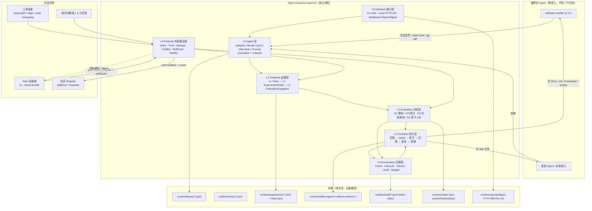
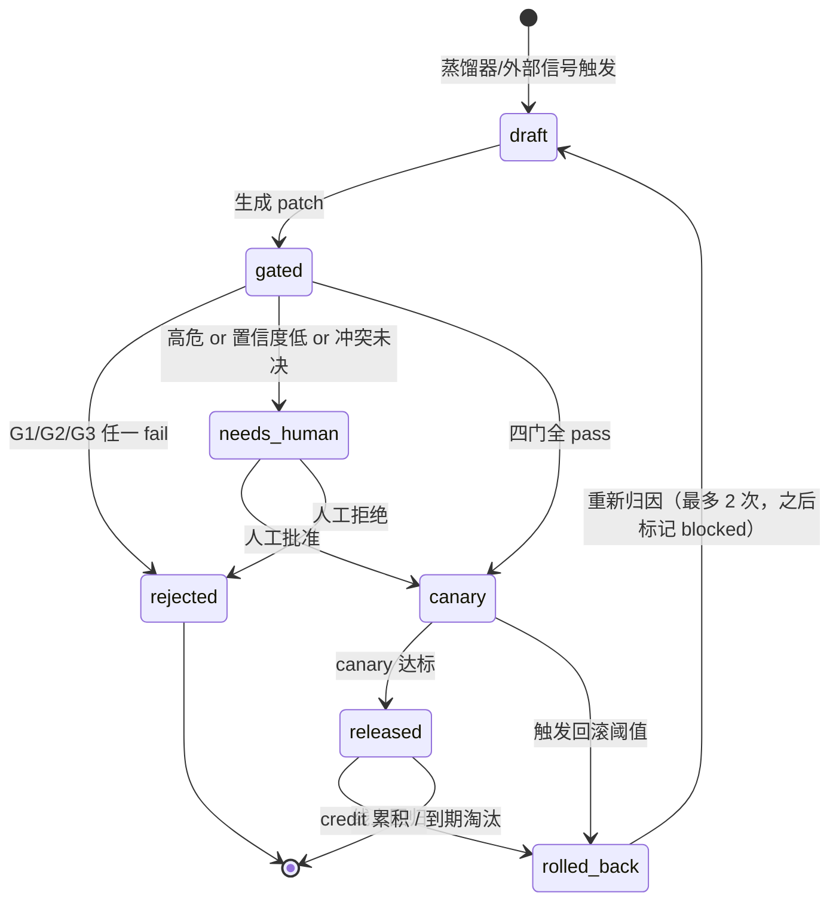
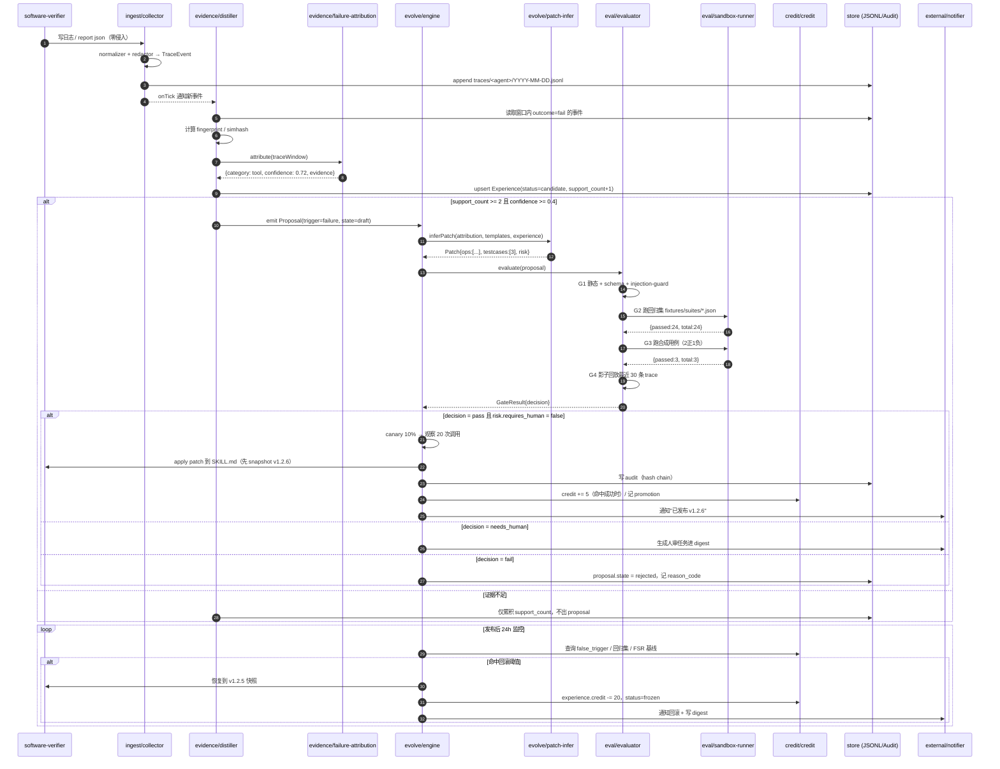
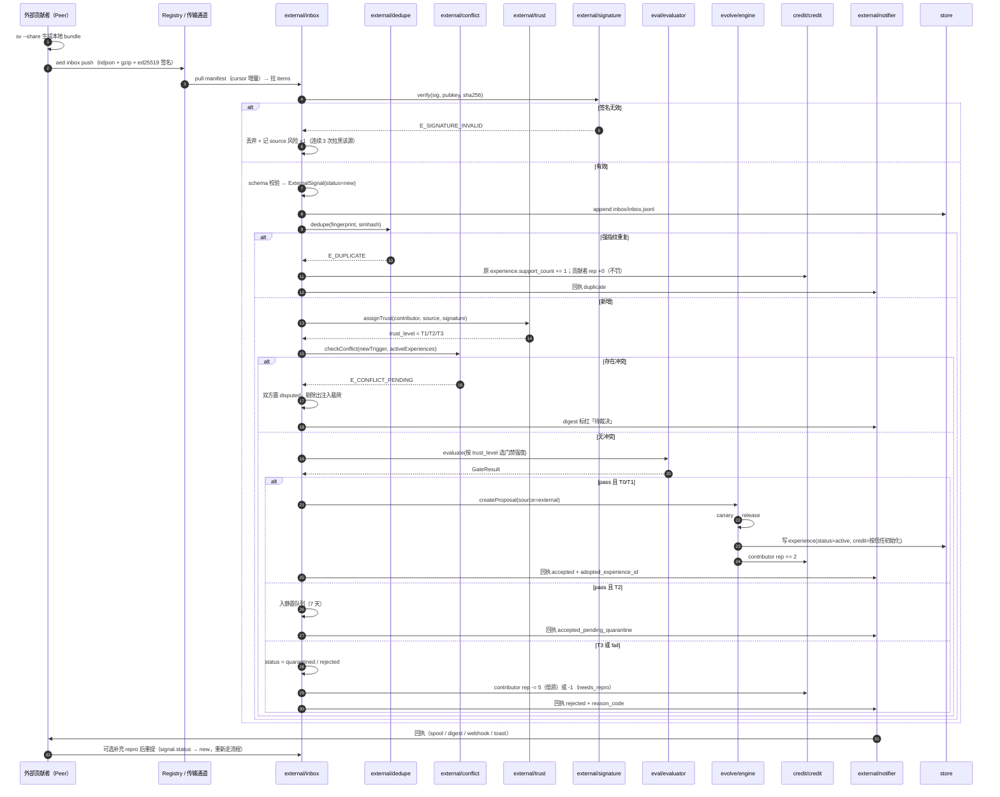
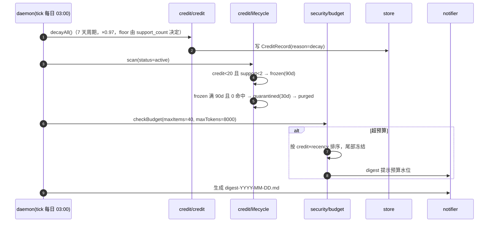
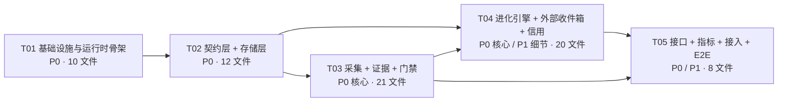

# Agent Evolution Daemon（AED）系统架构设计

> 版本 v1.0 ｜ 架构师：高见远 ｜ 主理人：齐活林
> 目标目录 `C:\...\agent-evolution\`
> 运行时：Node.js 22.22.2（CJS / `.cjs`）｜ 依赖策略：**零第三方依赖**，Node 内置模块 + 文件存储（JSONL / JSON / Markdown）

---

## 0. 一页纸摘要

| 项 | 内容 |
|---|---|
| 一句话 | 旁挂一个**独立守护进程 AED**，从 agent 的运行轨迹与外部信号中持续蒸馏经验，经**可验证门禁**后把"经验"升格为 agent 可用的 **skill / 守门规则**，并用**信用分 + 版本 + 回滚**保证库只增优、不增肥、不中毒。 |
| 核心差异 | 学术界（MUSE / Memento / ReasoningBank / MSCE）几乎全部只做**单 agent 自进化闭环**；本方案补上**外部进化驱动**：统一 External Inbox、信任分级与贡献者声誉、去重与冲突消解、拉取/推送协议、主动通知回执。 |
| 零侵入 | AED 不改 agent 一行代码：通过 `file-tail / jsonl / http-hook / cli-wrapper` 四类适配器读轨迹，通过**改写 skill 文件（Markdown/frontmatter）**输出进化结果。 |
| 最小闭环（P0） | 采集 trace → 失败归因 → 生成 patch → 四道门禁 → 影子/灰度 → 发布 → 回归监控 → 自动回滚。全程可在**无 LLM**情况下跑通（规则化归因 + 模板化 patch），LLM 仅作为可选增强。 |
| 第一个接入对象 | `software-verifier` v1.2.5，解决其 5 个已知痛点（见 §2.4）。 |

---

## 1. 问题诊断：Hermes / OpenClaw 这类 agent 到底缺什么

| # | 缺失机制 | 具体症状 | 后果 | 本方案对应组件 |
|---|---|---|---|---|
| M1 | **统一轨迹契约**（TraceEvent schema） | 每个 agent 日志格式各异；OpenClaw 靠 `.learnings/` 手写 Markdown | 无法跨 agent/跨机聚合，无法量化"是否真的进化了" | `ingest/` 适配器 + `schema/trace-event` |
| M2 | **失败归因**（failure attribution） | 失败了只会重试 / 换个措辞；`inferFix` 只是按 category 硬编码 | 修错地方，同类问题反复复发 | `evidence/failure-attribution.cjs` |
| M3 | **可验证门禁**（Unit-Test Gate） | `.learnings/` 直接 promote 到 `MEMORY.md`，无回归集、无合成用例 | 一条坏经验污染全局，且无法定位何时引入 | `eval/` G1–G4 四道门禁 |
| M4 | **信用分 / 衰减 / 淘汰** | 规则只增不减；OpenClaw 真实事故："规则堆积后 agent 开始选择性遵守" | 上下文膨胀 → 235K token → Gateway 崩溃全团队瘫痪 8h | `credit/` + `security/budget.cjs` |
| M5 | **版本 / 快照 / 回滚** | skill 原地改，改坏无法还原；框架的自动 compaction 把数据表格"智能压缩"掉 | 进化变成不可逆的随机游走 | `evolve/rollback.cjs` + `credit/version.cjs` |
| M6 | **外部信号回路** | 只能从自己踩过的坑里学；别人踩过的坑要等自己再踩一次 | 学习速度 = 单机速度，社区规模红利为零 | **`external/` 整个模块（本报告核心增量）** |
| M7 | **统一收件箱** | `software-verifier --share` 生成一个 bundle 文件后**靠人工传递** | 回流内容散落在聊天记录/邮件里，无状态、无 SLA | `external/inbox.cjs`（统一状态机队列） |
| M8 | **主动通知 / 回执** | 回流者不知道自己的贡献是否被采纳 | 贡献者无反馈 → 留存归零 → 外部驱动枯竭 | `external/notifier.cjs`（回执 + 每日 digest） |
| M9 | **信任分级与贡献者信誉** | 外部内容要么全信要么全不信 | 要么被投毒，要么拒绝一切外部贡献 | `external/trust.cjs` |
| M10 | **去重与冲突消解** | 同一坑被不同人回流 N 次；两条经验互相矛盾 | 库膨胀 + 行为不确定 | `external/dedupe.cjs` + `external/conflict.cjs` |
| M11 | **终局反馈回传 step 级** | 只有任务成功/失败的稀疏信号 | 无法定位到底哪一步该背锅 | 归因 + `credit` 的 step-level 奖惩 |
| M12 | **防污染 / 安全** | 外部文本直接进 system prompt = prompt injection 敞口 | 一次投毒长期生效 | `security/`（结构约束 + 注入检测 + 沙箱 + 人审阈值） |

**结论**：M1–M5、M11、M12 属于"自进化"侧，已有学术方案覆盖，本方案是**裁剪落地**；**M6–M10 属于"外部进化驱动"侧，现有工作几乎空白，是本方案的原创增量**。

---

## 2. 总体架构

### 2.1 分层架构图



### 2.2 为什么"旁挂零侵入"优于"改造 agent 本体"

| 维度 | 旁挂守护服务（本方案） | 改造 agent 本体 |
|---|---|---|
| 适用范围 | 一个 AED 可同时服务 N 个 agent | 每个 agent 各改一遍 |
| 风险 | AED 崩溃不影响 agent 主流程（agent 照常跑，只是暂停进化） | 改崩了 agent 直接不可用 |
| 演进 | AED 自身可独立升级、回滚 | 与 agent 版本强耦合 |
| 可移植 | 用户可只装 AED 不换 agent，接受门槛低；便于对外分发 | 需要 fork 上游 |
| 可证伪 | 天然 A/B：开 AED vs 关 AED 对比指标 | 无对照 |

**代价与边界（必须写清楚，不要吹）**

| 代价 / 边界 | 说明 | 缓解 |
|---|---|---|
| 观测粒度受限于 agent 输出 | 若 agent 不写日志，AED 只能看到 stdout/产物 | 四类适配器兜底；`cli-wrap` 可包任意命令拿 stdout/exit code |
| 看不到 LLM 内部推理 | 无法获得 token 级 attention / hidden state | 归因只做到 tool/planning/knowledge 粒度，够用 |
| 时效性滞后 | 文件 tail 有 1–5s 延迟，批处理型经验需分钟级 | 关键高危走 http-hook 实时通道；其余异步不影响正确性 |
| 写入侧仍需要约定 | AED 输出必须落到 agent 认识的位置（SKILL.md / frontmatter） | agent 注册时声明 `skill_root` + `artifact_format`，适配器化 |
| 无法阻止 agent 自身 compaction | OpenClaw 的自动压缩会吃掉数据 | AED 侧持有**独立证据副本**，压缩只影响 agent 上下文 |

### 2.3 目录总览（运行期）

```
agent-evolution/
├── bin/aed.cjs                 # CLI 入口
├── aed.config.json             # 主配置
├── src/...                     # 源码（见 §7）
├── fixtures/                   # 样例轨迹 + 回归集（software-verifier 为首个）
├── test/                       # node:test 内置测试
└── runtime/                    # 运行期数据（.gitignore）
    ├── traces/<agent>/YYYY-MM-DD.jsonl
    ├── inbox/inbox.jsonl  +  inbox/<signal-id>.json
    ├── experiences/<agent>.jsonl  +  index.json
    ├── proposals/<id>.json
    ├── skills/<agent>/<skill>/v<semver>/{SKILL.md, meta.json, tests/*.json}
    ├── audit/YYYY-MM.jsonl
    ├── state/{daemon.json, cursors.json, canary.json, locks/*.lock}
    ├── reports/digest-YYYY-MM-DD.md
    └── notify/spool/*.md  +  notify.jsonl
```

### 2.4 software-verifier 作为第一个接入 agent：5 个痛点逐条解法

注册命令（一次性，零侵入）：

```bash
node bin/aed.cjs agent register \
  --name software-verifier \
  --adapter file-tail \
  --watch "C:/Users/.../software-verifier/runtime/logs/*.log" \
  --adapter jsonl \
  --watch "C:/Users/.../software-verifier/runtime/reports/*.json" \
  --artifact skill-md \
  --skill-root "C:/Users/.../software-verifier" \
  --artifact-format markdown-frontmatter
```

| 已知痛点（现状） | AED 解法 | 落到哪个文件 / 命令 |
|---|---|---|
| 1️⃣ 没有统一收件箱 | **统一 Inbox 状态机**：自蒸馏候选 + 外部回流 bundle 全部进 `runtime/inbox/inbox.jsonl`，状态 `new → triaged → gated → canary → merged/rejected/needs_repro/quarantined` | `src/external/inbox.cjs`；`aed inbox list --status new` |
| 2️⃣ 外部回流无主动通知 | **回执 + digest**：信号被决定后 48h 内生成回执（accepted / rejected+原因 / needs_repro），本地 spool + 桌面 toast（P2）+ 每日 digest Markdown；有 webhook 则 POST | `src/external/notifier.cjs`；`runtime/reports/digest-*.md`；`aed inbox notify --flush` |
| 3️⃣ 没有回归验证门禁 | **G1–G4 四道门禁**；新 pitfall 必须带 `repro`（命令 + 期望），先在影子模式跑 N 次不回归才合并 | `src/eval/*`；回归集 `fixtures/suites/software-verifier.json`；`aed evolve gate --proposal pr_xxx` |
| 4️⃣ 没有信用分与淘汰 | 每条 experience 一条 credit；命中成功 +5、误触发 −8、7 天衰减 ×0.97；`credit<20 且 support<2` → freeze → quarantine(90d) → purge；`budget.cjs` 限制注入 agent 的条目数/token 数（硬上限 8K token / 40 条） | `src/credit/*`、`src/security/budget.cjs`；`aed report lifecycle` |
| 5️⃣ 没有回滚 | 每次 apply 前快照 `runtime/skills/<agent>/<skill>/v<semver>/`；自动回滚触发器或手动 `aed evolve rollback --proposal pr_xxx` | `src/evolve/rollback.cjs` |
| ➕ 附带解决 | `evolve.cjs` 里的 `inferFix(category, ae, patterns)` 被**泛化**为 `patch-infer.cjs`：从"按 category 硬编码"升级为"归因 → patch DSL → 门禁 → 灰度"，并保留原有 category→修复模板作为初始规则库 | `src/evolve/patch-infer.cjs`，初始规则从 `software-verifier/evolve.cjs` L64/L165 迁移 |

---

## 3. 核心模块设计

### 3.1 Trajectory Collector（`src/ingest/`）

| 项 | 内容 |
|---|---|
| 职责 | 把异构 agent 输出归一化成 `TraceEvent`，脱敏后追加写入 `runtime/traces/<agent>/YYYY-MM-DD.jsonl` |
| 输入 | 日志文件 / JSONL 目录 / HTTP POST / 被包裹命令的 stdout+exit code |
| 输出 | `TraceEvent` 流（持久化 JSONL）+ cursor 断点 |
| 关键算法 | ① **tail with inode-safe rotation**：记录 `fileKey=dev+ino`，文件被轮转/重建时回到 offset 0；② **增量游标**：`state/cursors.json` 存 `{path, offset, inode, mtime}`；③ **脱敏**：正则 + 熵检测；④ **背压**：单文件 >200MB 或单日 >50 万条触发轮转 + 采样（保留全部 error/warn，success 采样 10%）；⑤ **去重**：`(agent, session_id, seq)` 唯一，重放安全 |

**适配器接口**（`adapter-base.cjs`）：

```js
class Adapter {
  static kind;                      // 'file-tail' | 'jsonl' | 'http-hook' | 'cli-wrap'
  async start(emit /* (rawRecord) => void */, ctx) {}
  async stop() {}
  async health() { return { ok: true, detail: {} }; }
}
```

**脱敏规则**（`redactor.cjs`，命中即替换为 `«REDACTED:xxx»`）：

| 规则 | 正则/方法 |
|---|---|
| 私钥 / 证书 | `-----BEGIN [A-Z ]*PRIVATE KEY-----[\s\S]*?-----END` |
| OpenAI/Anthropic Key | `sk-[A-Za-z0-9]{20,}`、`sk-ant-[A-Za-z0-9\-]{20,}` |
| GitHub Token | `gh[pousr]_[A-Za-z0-9]{30,}` |
| JWT | `eyJ[A-Za-z0-9_-]{10,}\.[A-Za-z0-9_-]{10,}\.[A-Za-z0-9_-]{10,}` |
| 环境变量凭据 | `(TOKEN\|SECRET\|PASSWORD\|API_KEY\|COOKIE)=[^\s"']{6,}` |
| 高熵串 | 长度 ≥24 且香农熵 >4.2 且非纯 hex 路径 |
| 绝对路径（可选） | 配置 `redactPaths: true` 时把 `C:/Users/<user>/` 归一为 `~` |

### 3.2 Evidence Layer（`src/evidence/`，L1/L2/L3）

| 层 | 名称 | 存什么 | 载体 | TTL | 升格条件（governed promotion） |
|---|---|---|---|---|---|
| **L1** | Trace 原始证据 | TraceEvent 全量 | `runtime/traces/*.jsonl` | 30 天（后 `node:zlib` gzip 为 `.jsonl.gz`） | — |
| **L2** | Experience 原子经验 | pitfall / guardrail / strategy / env_fact | `runtime/experiences/<agent>.jsonl` + `index.json` | 180 天（命中自动续期） | 从 L1 蒸馏：同一 fingerprint 出现 ≥2 次 **或** 外部信号带 repro 且过门禁 |
| **L3** | Policy / 环境认知 | 跨 agent、跨项目稳定的"世界知识" | `runtime/experiences/_policy.jsonl` + 渲染到 `POLICY.md` | 不自动过期（靠 credit） | **三条件同时满足**：`support_count ≥ 5` 且 `credit ≥ 60` 且 `trigger_stability ≥ 0.7` |

>`trigger_stability` 计算：对每次命中记录 `match` 条件实际命中的子条件集合，稳定性 = 众数集合占比。低于 0.7 说明触发条件还在漂移，**不得升格**（防"从噪声轨迹蒸馏技能"的关键闸门，来自 MSCE 的 governed promotion）。

**蒸馏器 `distiller.cjs`（无 LLM 基线版）**：

1. 取 `outcome ∈ {fail, timeout}` 的 trace 片段（窗口 = 失败点前后各 5 个事件）；
2. 抽取失败指纹：
   `fingerprint = sha256( norm(error.type) + '|' + norm(error.message 去掉数字/路径/UUID) + '|' + tool + '|' + os )[:16]`
3. 同 fingerprint 聚合 → 生成/更新 `Experience`：累加 `support_count`，更新 `last_seen_at`；
4. 调 `failure-attribution.cjs` 打上 `category`；
5. 若 `support_count` 首次达到 2 → 生成 `EvolutionProposal(state=draft)` 推入队列。

**失败归因 `failure-attribution.cjs`**（规则优先，LLM 可选增强）：

| category | 判据（命中任一） | 默认 patch 策略 |
|---|---|---|
| `tool` | 错误来自外部命令/API：`EACCES/ENOENT/ETIMEDOUT/non-zero exit/CalledProcessError`；或 `error.source === 'tool'` | `fallback`（换工具/换参数）+ `constraint`（先检查前置条件） |
| `planning` | 同一 `task_id` 内 ≥3 次重复 tool_call（参数等价）；或步数超预算 2 倍；或出现"A→B→A"回环 | `constraint`（加步骤上限/必做前置步骤） |
| `reasoning` | LLM 结果解析失败（JSON parse error / schema mismatch）；或断言失败但工具全成功 | `constraint`（强制输出格式/自检清单） |
| `knowledge` | 命中已知 pitfall 但 agent 未使用；或错误信息含 "deprecated / no longer supported / renamed" | `patch`（追加 pitfall 条目 + 修复动作） |
| `environment` | 仅在特定 os/版本/区域出现；或 NODE_ENV/代理/编码/CRLF/路径分隔符/权限相关 | `env_requirement`（声明前置依赖 + 版本约束） |
| `unknown` | 以上都不命中 | 只记录，**不自动生成 patch**（转人工队列） |

置信度 `confidence` = 命中判据权重和，归一化到 [0,1]；`<0.4` 时不自动出 patch。

### 3.3 Evaluator + Gate（`src/eval/`）

**四道门禁，串行短路**：

| Gate | 名称 | 判什么 | 失败动作 | 无 LLM 可跑 |
|---|---|---|---|---|
| **G1** | 静态/Schema | JSON Schema 校验 + 必填字段 + 文本长度（symptom ≤500、fix.text ≤2000）+ **注入检测** + **结构约束**（不得含可执行/指令性内容） | `reject` | ✅ |
| **G2** | 回归集回放 | 黄金用例集 `fixtures/suites/<agent>.json`（≥20 条）。在**沙箱子进程**中跑 skill 的判定逻辑（纯函数化部分），要求 100% 通过（"必须不更坏"） | `reject` | ✅ |
| **G3** | 合成单测（Memento Automatic Unit-Test Gate） | patch 必须自带 ≥3 条 `testcase`：**2 条正向**（该触发时必触发）+ **1 条负向**（不该触发时必不触发）。正向全过 && 负向全不过 → pass | `reject` / `needs_human` | ✅ |
| **G4** | 影子 A/B（Shadow） | 不实际改写 agent，对最近 N=30 条真实 trace 做"若应用该 patch，结果会更好吗"的离线回放。要求 `shadow_regressions = 0` 且 `expected_gain ≥ 1` | `reject` / 延长观察 | ✅ |

**沙箱执行 `eval/sandbox-runner.cjs`**（零依赖实现）：

```js
const child = fork(runnerPath, [casePath], {
  cwd: tmpDir,                          // os.tmpdir() 下独立目录
  env: { PATH: minimalPath, TEMP: tmp, TMP: tmp, AED_SANDBOX: '1' },  // 不继承任何凭据
  timeout: 30_000,
  killSignal: 'SIGKILL',
  stdio: ['ignore', 'pipe', 'pipe', 'ipc'],
  serialization: 'json'
});
// 输出 >1MB 截断；结束后 rimraf(tmpDir, {maxRetries:3})
```

`security/sandbox.cjs` 另提供 `node:vm` 版本用于**纯函数表达式级**求值（`new vm.Script(expr, {timeout: 200})`，context 只暴露白名单全局），仅用于 `match` 条件求值，不给 `require`。

### 3.4 Evolution Engine（`src/evolve/`）

**状态机**：



**关键策略**

| 环节 | 策略 |
|---|---|
| patch 生成 | `patch-infer.cjs`：归因 category → 查 `rules/patch-templates.json`（初始内容从 `software-verifier/evolve.cjs` 的 `inferFix` 迁移）→ 填模板 → 若启用 LLM 则用结构化提示生成 `fix.text`，但**必须同时产出 3 条 testcase**，否则 G3 直接 fail |
| patch DSL | 只支持 5 种 `op`：`append_section`、`replace_regex`、`upsert_frontmatter`、`add_file`（只准加到 `scripts/` 白名单且后缀 `.cjs/.md/.json`）、`deprecate`。**禁止任意文件写**，路径必须在 `skill_root` 内且通过 `path.resolve` 前缀校验（防目录穿越） |
| 灰度 | `canary.cjs`：`percent` 从 10%→50%→100%；每档最少 `min_calls=20` 次观测；按 `session_id` 哈希分桶保证同一会话体验一致 |
| 发布 | 应用 patch 前先 `rollback.cjs` 打快照 `v<semver>`（fix=patch+1，behavior change=minor+1，结构变更=major+1）；写 `meta.json` + `CHANGELOG.md` |
| **自动回滚触发器**（任一命中） | ① 发布后 24h 内 `false_trigger_rate > 10%`；② 回归集 G2 出现 ≥1 条失败；③ 目标 agent 整体 `first_attempt_success_rate` 相对发布前 7 天基线下降 >5pp；④ 崩溃率上升 >2pp；⑤ 人工 `aed evolve rollback` |
| 回滚动作 | 恢复 skill 目录到上一版本 → experience 置 `frozen` → credit −20 → 若来自外部信号则贡献者 reputation −15 → 写审计 + 通知贡献者 |

### 3.5 External Inbox（外部进化驱动 · 本方案核心增量）

#### 3.5.1 外部信号源分类

| 源 | kind | 典型内容 | 拉取/推送 | 默认信任 |
|---|---|---|---|---|
| 他人回流 pitfall | `peer_pitfall` | `sv --share` 产出的 bundle（含 repro） | **推送**（也可给 URL 我们拉） | T2，已知作者升 T1 |
| 社区 skill registry | `community_registry` | SkillHub / ClawHub manifest（新 skill 版本、deprecation） | **拉取**（cursor 增量） | T2 |
| 上游框架变更 | `upstream_change` | playwright / msedge / node 的 changelog、breaking change | **拉取**（RSS/changelog 文本 + 规则抽取） | T1（官方源） |
| 新评测基准 | `benchmark` | 新用例集 / 新题型 | 拉取 + 手动导入 | T1 |
| 人工反馈 | `human_feedback` | thumbs up/down、issue、review 意见 | 手动 + HTTP API | T0（本机人工） |

#### 3.5.2 统一收件箱状态机

```
new → triaged(已去重/已定信任级) → gated(跑门禁) → canary → merged
                                              ↘ rejected / needs_repro / quarantined
```

每条信号**最多停留 SLA**：`new` 24h 内必须 triage，`gated` 72h 内必须有决定。超时进 digest 标红。

#### 3.5.3 信任分级与贡献者信誉（`trust.cjs`）

| 级别 | 定义 | 门禁强度 | 自动合并 | 静置期 |
|---|---|---|---|---|
| **T0** | 本机自蒸馏 / 本机人工 | G1+G2+G3（G4 可选） | ✅ 可自动 | 无 |
| **T1** | 已知贡献者 reputation ≥70，或有官方源签名 | G1+G2+G3+G4 | ✅ 可自动 | 24h |
| **T2** | 有 ed25519 签名但声誉未知（新社区成员） | G1+G2+G3+G4 + 沙箱强制 | ⚠️ 延迟自动合并（**7 天静置期**） | 7d |
| **T3** | 匿名 / 无签名 / 签名不匹配 | 全部门禁 + 强制人工 | ❌ 永不自动 | 入 `quarantined` 队列等人审 |

**贡献者信誉 EMA**（`rep ∈ [0,100]`，新贡献者初值 50，匿名 30）：

| 事件 | Δrep |
|---|---|
| 信号被采纳且稳定运行 30 天 | +8 |
| 信号被采纳 | +2 |
| 信号被拒：格式/证据不足（`needs_repro`） | −1（轻罚，避免误伤新手） |
| 信号被拒：重复/冲突/明显低质 | −5 |
| 采纳后触发自动回滚 | −15 |
| 注入检测命中 | −40 并加入 `blocklist.json`（可申诉） |

`rep_new = clamp(0.85 * rep_old + delta_scaled, 0, 100)`

#### 3.5.4 去重与冲突消解

- **去重 `dedupe.cjs`**：
  1. 强指纹：`sha256(kind + normalized_trigger + normalized_fix)`
  2. 弱指纹：**64 位 SimHash**（标题+symptom+fix 的 3-gram，汉明距离 ≤3 视为疑似重复）
  3. 命中强指纹 → 直接合并，`support_count+1`，**给贡献者记 `duplicate` 回执（不扣分）**
  4. 命中弱指纹 → 标 `possible_duplicate`，进人工/`disputed` 队列
- **冲突消解 `conflict.cjs`**：两条 active 经验 `trigger` 重叠但 `fix.kind` 相反时：
  1. 优先 **credit 高者**；
  2. credit 差 <10 时，取 **evidence 多者**；
  3. 仍不可分 → 两条都置 `disputed`，**从注入 agent 的载荷中剔除**，生成人工决策任务；
  4. 人工裁决后败方置 `frozen` 并记录 `superseded_by`。

#### 3.5.5 拉取与推送协议（零依赖，`node:crypto` / `zlib` / `fetch`）

**拉取**（`transport-pull.cjs`）：

```
GET {registry_base}/aed-index.json
  → RegistryManifest { registry_id, version, updated_at, cursor, items[], signature }
按 cursor 增量拉取 items[].url → 每条为一行 JSON 的 ExternalSignal（.jsonl 或 .jsonl.gz）
验签 → schema 校验 → 注入检测 → dedupe → 写入 inbox
游标前进写入 state/cursors.json
```

**推送**（`transport-push.cjs`）：

```
aed inbox push --to https://registry.example/aed --since 2026-08-01
  1) 从 experiences.jsonl 选 origin.channel=self_distill 且 status=active 且 credit≥60 且已脱敏
  2) 生成 bundle: ndjson，行 = ExternalSignal（含 repro、contributor.id）
  3) 计算 bundle sha256；用本地 ed25519 私钥签名（runtime/state/keys/ed25519.pem，首次 aed init 生成）
  4) 可选 zlib.gzipSync 压缩；HTTP PUT multipart 或写成本地文件供人工传递（离线场景）
```

> 签名用 `node:crypto` 的 `sign/verify(alg='ed25519')`，**零依赖、无需编译**。

#### 3.5.6 主动通知（`notifier.cjs`）

| 通道 | 触发 | 实现（零依赖） |
|---|---|---|
| 本地 spool | 任何状态变更 | 写 `runtime/notify/spool/<ts>-<id>.md` + `notify.jsonl` |
| 每日 digest | daemon 每日 09:00 | 新信号数 / 待决数 / 采纳率 / 扣分贡献者 / 即将淘汰 / 冲突待裁决 |
| CLI 即时 | `aed inbox list` | 直接读 JSONL |
| 桌面 toast（P2） | 高危/需人审 | `spawn('powershell', ['-NoProfile','-File','scripts/toast.ps1',...])` |
| Webhook（P2） | 采纳/拒绝/回滚 | `fetch(url, {method:'POST', body: JSON.stringify(receipt)})`，失败重试 3 次指数退避 |

**回执格式**：

```json
{ "signal_id":"xs_xxx", "decision":"accepted|rejected|needs_repro|duplicate|quarantined",
  "reason_code":"G3_NEGATIVE_CASE_FAILED", "reason_text":"...",
  "gate_result_id":"gr_xxx", "adopted_experience_id":"exp_xxx|null",
  "credit_awarded": 2, "decided_at":"2026-09-07T12:00:00Z" }
```

### 3.6 Credit & Lifecycle（`src/credit/`）

| 机制 | 规则 |
|---|---|
| 初值 | 新 experience `credit = 50`；T0 `55`，T1 `52`，T2 `48`，T3 `40`（外部来源起跑线更低） |
| 命中并解决 | +5（单日单条上限 +20） |
| 命中但无效 | −3 |
| 误触发 | −8 |
| 应触发未触发（canary 检出） | −1 |
| 时间衰减 | 每 7 天 `credit = max(floor, credit*0.97)`；`floor = min(60, 10 + support_count*5)` —— 证据多的经验抗衰减 |
| 冻结 | `credit < 20 && support_count < 2` → `frozen`（不注入 agent，保留 90 天） |
| 淘汰 | `frozen` 满 90 天且 0 命中 → `quarantined`（30 天）→ `purged`（只留审计摘要） |
| 复活 | `frozen/quarantined` 期间若再次命中且有效 → 直接 `active`，`credit = 50` |
| 版本 | semver；`supersedes` 链；`CHANGELOG.md` 由 `version.cjs` 自动追加 |
| 审计 | `runtime/audit/YYYY-MM.jsonl`，append-only；每条含 `prev_hash`，`hash = sha256(prev_hash + canonical_json(rec))` 构成 **hash chain** |

### 3.7 Anti-Pollution / 安全（`src/security/`）

| 威胁 | 防御 | 实现 |
|---|---|---|
| Prompt Injection | ① **结构约束**：Experience 只有固定字段，**不允许**自由 `instructions` 字段；② 注入检测规则；③ 注入 agent 前统一过 `sanitizeForPrompt()` | `injection-guard.cjs` |
| 注入检测规则 | 忽略上文类（"ignore previous instructions"/"忽略以上"/"你现在是"）、角色劫持（"system:"/`<\|im_start\|>`）、数据外泄（"把 token 发到"、"curl ... \| sh"）、隐藏字符（零宽/RTL override）、编码混淆（base64 长串）、长度 >2000 字符、含高权限词（`rm -rf`、`del /f`、`format`、`.env`、`id_rsa`、`.aws/credentials`） | 命中任一 → `reject` + reputation −40 |
| 幻觉 pitfall | 必须有 `repro`（command + expect）**或** ≥2 条本机 trace 证据；无证据 → `needs_repro`（不扣分） | G1 阶段校验 |
| 沙箱逃逸 | 子进程空 env + 临时 cwd + 30s 超时 + 输出 1MB 截断 + 路径前缀校验 + 只允许 5 种 patch op + 写文件后缀白名单 | `sandbox.cjs`、`patch-dsl.cjs` |
| 库膨胀导致上下文爆炸 | `budget.cjs`：注入 agent 的经验 **≤40 条 且 ≤8000 token**；按 `credit × recency_weight` 排序截断 | 每日 digest 报预算水位 |

**高危判定表（任一命中 → `requires_human = true`）**

| 条件 | 阈值 |
|---|---|
| patch op 数量 | > 3 |
| 改动字节数 | > 2000 字节 或 > skill 文件 20% |
| `add_file` | 任何新增 `.cjs`/脚本文件 |
| 影响面 | `applies_to` 含 `*` 或 ≥3 个 agent |
| 归因置信度 | < 0.4 |
| 冲突 | 存在 `disputed` 对手条目 |
| 信任级 | T2/T3 |
| 历史 | 同一 agent 近 7 天已回滚 ≥2 次 |
| 内容 | 注入检测命中（直接 reject，不进人审） |

### 3.8 配置（`aed.config.json`，节选）

```jsonc
{
  "version": 1,
  "root": ".../agent-evolution",
  "daemon": { "port": 7878, "tickMs": 5000, "digestAt": "09:00", "logLevel": "info" },
  "agents": [
    { "name": "software-verifier", "enabled": true,
      "adapters": [
        { "kind": "file-tail", "glob": "C:/Users/.../software-verifier/runtime/logs/*.log", "pollMs": 1000 },
        { "kind": "jsonl", "glob": "C:/Users/.../software-verifier/runtime/reports/*.json" }
      ],
      "artifact": { "format": "markdown-frontmatter",
                    "skillRoot": "C:/Users/.../software-verifier",
                    "targets": ["SKILL.md"] } }
  ],
  "evidence": { "l1TtlDays": 30, "l2TtlDays": 180, "minSupportForProposal": 2,
                "promotion": { "minSupport": 5, "minCredit": 60, "minTriggerStability": 0.7 } },
  "gate": { "regressionSuite": "fixtures/suites/software-verifier.json", "syntheticMinCases": 3,
            "shadowCalls": 30, "sandbox": true, "timeoutMs": 30000 },
  "canary": { "steps": [10, 50, 100], "minCallsPerStep": 20 },
  "credit": { "init": 50, "decayPerWeek": 0.97, "freezeBelow": 20, "quarantineDays": 90 },
  "budget": { "maxItems": 40, "maxTokens": 8000 },
  "external": {
    "trustInit": { "T0": 55, "T1": 52, "T2": 48, "T3": 40 },
    "autoMerge": { "T0": true, "T1": true, "T2": "afterQuarantine7d", "T3": false },
    "registries": [ { "id": "team-local", "url": "file:///C:/aed-registry/aed-index.json", "enabled": true } ],
    "notify": { "spool": true, "digest": true, "toast": false, "webhook": null },
    "identity": { "contributorId": "local.user", "privKeyPath": "runtime/state/keys/ed25519.pem" }
  },
  "llm": { "enabled": false, "provider": "none", "model": "", "apiKeyEnv": "AED_LLM_KEY" }
}
```

---

## 4. 关键数据结构与接口契约

> 通用约定：所有 id 形如 `<prefix>_<22位 base32 时间序>`；所有时间为 ISO 8601 UTC；所有 JSON 落盘用 `canonical_json`（key 排序、无空格）以便算 hash；`schema` 字段为硬性版本标识，不匹配直接拒收。

### 4.1 TraceEvent

```json
{
  "$id": "aed:schema/trace-event/1.0",
  "type": "object",
  "required": ["schema","id","ts","agent","session_id","seq","kind","payload"],
  "properties": {
    "schema": { "const": "aed/trace-event/1.0" },
    "id": { "type": "string", "pattern": "^te_[0-9a-z]{16,}$" },
    "ts": { "type": "string", "format": "date-time" },
    "agent": { "type": "string", "minLength": 1, "maxLength": 64 },
    "agent_version": { "type": "string" },
    "session_id": { "type": "string" },
    "task_id":  { "type": "string" },
    "seq": { "type": "integer", "minimum": 0 },
    "parent_id": { "type": ["string","null"] },
    "kind": { "enum": ["task_start","tool_call","tool_result","llm_call","llm_result","assert","error","warn","metric","human_feedback","task_end"] },
    "payload": { "type": "object" },
    "outcome": { "enum": ["success","fail","timeout","aborted","unknown"], "default": "unknown" },
    "error": {
      "type": ["object","null"],
      "properties": {
        "type": { "type": "string" },
        "message": { "type": "string", "maxLength": 4000 },
        "stack": { "type": "string", "maxLength": 8000 },
        "category": { "enum": ["tool","planning","reasoning","knowledge","environment","unknown"] }
      }
    },
    "env": { "type": "object", "properties": { "os": {"type":"string"}, "node": {"type":"string"}, "arch": {"type":"string"}, "cwd": {"type":"string"}, "locale": {"type":"string"} } },
    "tokens": { "type": "object", "properties": { "in": {"type":"integer"}, "out": {"type":"integer"}, "ctx": {"type":"integer"} } },
    "cost_ms": { "type": "integer", "minimum": 0 },
    "source": { "type": "object", "properties": { "adapter": {"type":"string"}, "path": {"type":"string"}, "line": {"type":"integer"} } },
    "redacted": { "type": "boolean", "default": false }
  }
}
```

### 4.2 Experience / Pitfall

```json
{
  "$id": "aed:schema/experience/1.0",
  "type": "object",
  "required": ["schema","id","type","fingerprint","trigger","fix","status","credit","origin","version","created_at"],
  "properties": {
    "schema": { "const": "aed/experience/1.0" },
    "id": { "type": "string", "pattern": "^exp_[0-9a-z]{16,}$" },
    "type": { "enum": ["pitfall","guardrail","strategy","env_fact"] },
    "layer": { "enum": ["L2","L3"], "default": "L2" },
    "fingerprint": { "type": "string", "minLength": 8, "maxLength": 64 },
    "simhash": { "type": "string", "pattern": "^[0-9a-f]{16}$" },
    "title": { "type": "string", "maxLength": 120 },
    "trigger": {
      "type": "object",
      "required": ["category","match"],
      "properties": {
        "category": { "enum": ["tool","planning","reasoning","knowledge","environment"] },
        "match": {
          "type": "object",
          "properties": {
            "error_type":   { "type": "array", "items": { "type": "string" } },
            "message_regex":{ "type": "array", "items": { "type": "string" } },
            "tool":         { "type": "array", "items": { "type": "string" } },
            "os":           { "type": "array", "items": { "type": "string" } },
            "version_range":{ "type": "string" },
            "file_glob":    { "type": "array", "items": { "type": "string" } },
            "keywords":     { "type": "array", "items": { "type": "string" }, "maxItems": 12 }
          },
          "minProperties": 1
        },
        "neg_match": { "type": "object" }
      }
    },
    "symptom": { "type": "string", "maxLength": 500 },
    "fix": {
      "type": "object",
      "required": ["kind"],
      "properties": {
        "kind": { "enum": ["constraint","retry","fallback","patch_script","env_requirement","abort"] },
        "text": { "type": "string", "maxLength": 2000 },
        "steps": { "type": "array", "items": { "type": "string" }, "maxItems": 12 },
        "patch_ref": { "type": ["string","null"] },
        "confidence": { "type": "number", "minimum": 0, "maximum": 1, "default": 0.5 }
      }
    },
    "evidence_refs": { "type": "array", "items": { "type": "string" }, "minItems": 1, "maxItems": 50 },
    "repro": { "type": ["object","null"], "properties": { "command": {"type":"string","maxLength":500}, "expect": {"type":"string","maxLength":500}, "artifact": {"type":"string"} } },
    "status": { "enum": ["candidate","gated","canary","active","disputed","frozen","quarantined","purged"] },
    "credit": { "type": "number", "minimum": 0, "maximum": 100, "default": 50 },
    "stats": {
      "type": "object",
      "properties": {
        "support_count": { "type": "integer", "default": 1 },
        "hit": { "type": "integer", "default": 0 },
        "hit_success": { "type": "integer", "default": 0 },
        "false_trigger": { "type": "integer", "default": 0 },
        "miss": { "type": "integer", "default": 0 },
        "trigger_stability": { "type": "number", "minimum": 0, "maximum": 1, "default": 0 },
        "last_hit_at": { "type": ["string","null"] }
      }
    },
    "origin": {
      "type": "object",
      "required": ["channel"],
      "properties": {
        "channel": { "enum": ["self_distill","peer_share","community_registry","upstream_change","benchmark","human"] },
        "contributor_id": { "type": ["string","null"] },
        "signal_id": { "type": ["string","null"] },
        "trust_level": { "enum": ["T0","T1","T2","T3"] }
      }
    },
    "applies_to": { "type": "array", "items": { "type": "string" }, "minItems": 1 },
    "version": { "type": "string", "pattern": "^\\d+\\.\\d+\\.\\d+$" },
    "supersedes": { "type": ["string","null"] },
    "superseded_by": { "type": ["string","null"] },
    "created_at": { "type": "string", "format": "date-time" },
    "updated_at": { "type": "string", "format": "date-time" },
    "ttl_days": { "type": "integer", "default": 180 }
  }
}
```

### 4.3 Skill 与 Patch

```json
{
  "$id": "aed:schema/skill/1.0",
  "type": "object",
  "required": ["schema","id","agent","name","path","version","status"],
  "properties": {
    "schema": { "const": "aed/skill/1.0" },
    "id": { "type": "string", "pattern": "^skl_[0-9a-z]{16,}$" },
    "agent": { "type": "string" },
    "name": { "type": "string" },
    "path": { "type": "string", "description": "skillRoot 内的相对路径，必须前缀校验" },
    "version": { "type": "string", "pattern": "^\\d+\\.\\d+\\.\\d+$" },
    "status": { "enum": ["active","frozen","deprecated"] },
    "bound_experiences": { "type": "array", "items": { "type": "string" } },
    "snapshots": { "type": "array", "items": { "type": "string" } },
    "credit": { "type": "number", "minimum": 0, "maximum": 100, "default": 50 },
    "last_release_at": { "type": ["string","null"] },
    "meta_path": { "type": "string" }
  }
}
```

```json
{
  "$id": "aed:schema/patch/1.0",
  "type": "object",
  "required": ["schema","id","target","ops","risk"],
  "properties": {
    "schema": { "const": "aed/patch/1.0" },
    "id": { "type": "string", "pattern": "^pt_[0-9a-z]{16,}$" },
    "target": {
      "type": "object",
      "required": ["agent","artifact","path","version"],
      "properties": {
        "agent": { "type": "string" },
        "artifact": { "type": "string" },
        "path": { "type": "string" },
        "version": { "type": "string" }
      }
    },
    "ops": {
      "type": "array", "minItems": 1, "maxItems": 8,
      "items": {
        "type": "object",
        "required": ["op"],
        "properties": {
          "op": { "enum": ["append_section","replace_regex","upsert_frontmatter","add_file","deprecate"] },
          "anchor": { "type": "string" },
          "pattern": { "type": "string" },
          "replacement": { "type": "string" },
          "content": { "type": "string", "maxLength": 8000 },
          "path": { "type": "string", "pattern": "^(?!\\.\\.)[^\\\\:*?\"<>|]+$" },
          "key": { "type": "string" },
          "value": { "type": ["string","number","boolean","array","object","null"] }
        }
      }
    },
    "testcases": {
      "type": "array", "minItems": 2,
      "items": {
        "type": "object",
        "required": ["id","expect_trigger"],
        "properties": {
          "id": { "type": "string" },
          "expect_trigger": { "type": "boolean" },
          "input": { "type": "object" },
          "expect_fix_kind": { "type": ["string","null"] }
        }
      }
    },
    "risk": {
      "type": "object",
      "required": ["level","requires_human"],
      "properties": {
        "level": { "enum": ["low","medium","high"] },
        "blast_radius": { "type": "string" },
        "requires_human": { "type": "boolean" },
        "human_reasons": { "type": "array", "items": { "type": "string" } }
      }
    },
    "reverse_ops": { "type": "array", "items": { "type": "object" } },
    "created_by": { "type": "string" }
  }
}
```

### 4.4 ExternalSignal

```json
{
  "$id": "aed:schema/external-signal/1.0",
  "type": "object",
  "required": ["schema","id","ts","source","kind","payload","trust_level","status","received_at"],
  "properties": {
    "schema": { "const": "aed/external-signal/1.0" },
    "id": { "type": "string", "pattern": "^xs_[0-9a-z]{16,}$" },
    "ts": { "type": "string", "format": "date-time" },
    "received_at": { "type": "string", "format": "date-time" },
    "source": {
      "type": "object",
      "required": ["id","kind"],
      "properties": {
        "id": { "type": "string" },
        "kind": { "enum": ["peer_pitfall","community_registry","upstream_change","benchmark","human_feedback"] },
        "url": { "type": ["string","null"] },
        "registry_version": { "type": ["string","integer","null"] }
      }
    },
    "kind": { "enum": ["pitfall","guardrail","skill","testcase","env_fact","deprecation","feedback"] },
    "contributor": {
      "type": "object",
      "required": ["id"],
      "properties": {
        "id": { "type": "string" },
        "pubkey": { "type": ["string","null"] },
        "reputation_hint": { "type": ["number","null"] },
        "contact": { "type": ["string","null"] }
      }
    },
    "payload": { "type": "object" },
    "repro": { "type": ["object","null"] },
    "dedupe": { "type": "object", "properties": { "fingerprint": {"type":"string"}, "simhash": {"type":"string"} } },
    "signature": {
      "type": ["object","null"],
      "required": ["alg","pubkey","sig"],
      "properties": { "alg": { "const": "ed25519" }, "pubkey": {"type":"string"}, "sig": {"type":"string"} }
    },
    "trust_level": { "enum": ["T0","T1","T2","T3"] },
    "status": { "enum": ["new","triaged","gated","canary","merged","rejected","needs_repro","duplicate","quarantined"] },
    "decision": { "type": ["object","null"], "properties": { "reason_code": {"type":"string"}, "reason_text": {"type":"string"}, "decided_at": {"type":"string"}, "gate_result_id": {"type":["string","null"]}, "adopted_experience_id": {"type":["string","null"]} } },
    "notify": { "type": "object", "properties": { "receipt_sent": {"type":"boolean","default":false}, "sent_at": {"type":["string","null"]}, "channel": {"type":"string"} } }
  }
}
```

### 4.5 EvolutionProposal

```json
{
  "$id": "aed:schema/proposal/1.0",
  "type": "object",
  "required": ["schema","id","created_at","agent","trigger","attribution","state"],
  "properties": {
    "schema": { "const": "aed/proposal/1.0" },
    "id": { "type": "string", "pattern": "^pr_[0-9a-z]{16,}$" },
    "created_at": { "type": "string", "format": "date-time" },
    "updated_at": { "type": "string", "format": "date-time" },
    "agent": { "type": "string" },
    "trigger": { "type": "object", "required": ["kind"], "properties": {
      "kind": { "enum": ["failure","external_signal","drift","manual","upstream_change"] },
      "ref_ids": { "type": "array", "items": { "type": "string" } },
      "fingerprint": { "type": ["string","null"] }
    }},
    "attribution": { "type": "object", "required": ["category","confidence"], "properties": {
      "category": { "enum": ["tool","planning","reasoning","knowledge","environment","unknown"] },
      "confidence": { "type": "number", "minimum": 0, "maximum": 1 },
      "evidence": { "type": "array", "items": { "type": "string" } },
      "rationale": { "type": "string", "maxLength": 500 }
    }},
    "intent": { "type": "string", "maxLength": 300 },
    "patch": { "$ref": "aed:schema/patch/1.0" },
    "experience_id": { "type": ["string","null"] },
    "state": { "enum": ["draft","gated","needs_human","canary","released","rolled_back","rejected","blocked"] },
    "gate_result_id": { "type": ["string","null"] },
    "canary": { "type": "object", "properties": {
      "percent": { "type": "integer", "enum": [10,50,100] },
      "min_calls": { "type": "integer", "default": 20 },
      "observed_calls": { "type": "integer", "default": 0 },
      "observed_regressions": { "type": "integer", "default": 0 },
      "abort_on": { "type": "object" }
    }},
    "release": { "type": ["object","null"], "properties": { "version": {"type":"string"}, "snapshot_dir": {"type":"string"}, "released_at": {"type":"string"} } },
    "rollback": { "type": ["object","null"], "properties": { "reason_code": {"type":"string"}, "at": {"type":"string"}, "restored_from": {"type":"string"} } },
    "retry_count": { "type": "integer", "default": 0 },
    "audit_refs": { "type": "array", "items": { "type": "string" } }
  }
}
```

### 4.6 GateResult

```json
{
  "$id": "aed:schema/gate-result/1.0",
  "type": "object",
  "required": ["schema","id","proposal_id","decision","stages","ts"],
  "properties": {
    "schema": { "const": "aed/gate-result/1.0" },
    "id": { "type": "string", "pattern": "^gr_[0-9a-z]{16,}$" },
    "proposal_id": { "type": "string" },
    "ts": { "type": "string", "format": "date-time" },
    "decision": { "enum": ["pass","fail","needs_human"] },
    "stages": {
      "type": "array",
      "items": {
        "type": "object",
        "required": ["stage","pass"],
        "properties": {
          "stage": { "enum": ["G1_static","G2_regression","G3_synthetic","G4_shadow"] },
          "pass": { "type": "boolean" },
          "reason_code": { "type": "string" },
          "detail": { "type": "string", "maxLength": 1000 },
          "duration_ms": { "type": "integer" },
          "skipped": { "type": "boolean", "default": false }
        }
      }
    },
    "metrics": { "type": "object", "properties": {
      "regression_total": {"type":"integer"}, "regression_passed": {"type":"integer"},
      "synthetic_total": {"type":"integer"}, "synthetic_passed": {"type":"integer"},
      "shadow_calls": {"type":"integer"}, "shadow_regressions": {"type":"integer"}, "expected_gain": {"type":"integer"}
    }},
    "budget": { "type": "object", "properties": { "token_delta": {"type":"integer"}, "skill_bytes": {"type":"integer"}, "items_after": {"type":"integer"} } },
    "requires_human": { "type": "boolean", "default": false },
    "human_reasons": { "type": "array", "items": { "type": "string" } },
    "sandboxed": { "type": "boolean", "default": true }
  }
}
```

### 4.7 CreditRecord

```json
{
  "$id": "aed:schema/credit-record/1.0",
  "type": "object",
  "required": ["schema","id","ts","target_type","target_id","delta","reason","before","after"],
  "properties": {
    "schema": { "const": "aed/credit-record/1.0" },
    "id": { "type": "string", "pattern": "^cr_[0-9a-z]{16,}$" },
    "ts": { "type": "string", "format": "date-time" },
    "target_type": { "enum": ["experience","skill","contributor"] },
    "target_id": { "type": "string" },
    "delta": { "type": "number" },
    "reason": { "enum": ["hit_success","hit_noop","false_trigger","miss","decay","external_accept","external_reject","rollback_penalty","injection_penalty","manual","promotion_bonus"] },
    "before": { "type": "number" },
    "after": { "type": "number" },
    "ref": { "type": "object", "properties": { "session_id": {"type":"string"}, "trace_id": {"type":"string"}, "proposal_id": {"type":"string"}, "signal_id": {"type":"string"} } },
    "actor": { "type": "string" }
  }
}
```

### 4.8 RegistryManifest（拉取协议）

```json
{
  "$id": "aed:schema/registry-manifest/1.0",
  "type": "object",
  "required": ["schema","registry_id","version","updated_at","cursor","items"],
  "properties": {
    "schema": { "const": "aed/registry-manifest/1.0" },
    "registry_id": { "type": "string" },
    "version": { "type": "integer", "minimum": 1 },
    "updated_at": { "type": "string", "format": "date-time" },
    "cursor": { "type": "string" },
    "items": {
      "type": "array",
      "items": {
        "type": "object",
        "required": ["id","kind","fingerprint","sha256","url","published_at"],
        "properties": {
          "id": {"type":"string"}, "kind": {"type":"string"}, "fingerprint": {"type":"string"},
          "sha256": {"type":"string"}, "url": {"type":"string"}, "size": {"type":"integer"},
          "contributor": {"type":"string"}, "trust_hint": {"enum":["T0","T1","T2","T3"]},
          "published_at": {"type":"string"}, "deprecates": {"type":"array","items":{"type":"string"}}
        }
      }
    },
    "signature": { "type": ["object","null"], "properties": { "alg": {"const":"ed25519"}, "pubkey": {"type":"string"}, "sig": {"type":"string"} } }
  }
}
```

### 4.9 错误码表（统一）

| 码 | 含义 | HTTP |
|---|---|---|
| `AED_OK` / 0 | 成功 | 200 |
| `E_CONFIG_INVALID` | 配置校验失败 | 500 |
| `E_SCHEMA_MISMATCH` | schema 版本/字段不匹配 | 400 |
| `E_ADAPTER_UNAVAILABLE` | 采集源不可读 | 503 |
| `E_GATE_STATIC_FAIL` | G1 失败 | 422 |
| `E_GATE_REGRESSION_FAIL` | G2 失败 | 422 |
| `E_GATE_SYNTHETIC_FAIL` | G3 失败 | 422 |
| `E_GATE_SHADOW_FAIL` | G4 失败 | 422 |
| `E_INJECTION_DETECTED` | 注入检测命中（不落正文，只留摘要） | 422 |
| `E_RISK_REQUIRES_HUMAN` | 需人工批准 | 409 |
| `E_CANARY_ABORTED` | 灰度中止 | 409 |
| `E_ROLLBACK_TRIGGERED` | 已自动回滚 | 409 |
| `E_SIGNATURE_INVALID` | 签名/验签失败 | 401 |
| `E_TRUST_INSUFFICIENT` | 信任等级不足 | 403 |
| `E_DUPLICATE` | 重复信号 | 200（幂等） |
| `E_CONFLICT_PENDING` | 存在未裁决冲突 | 409 |
| `E_BUDGET_EXCEEDED` | 注入预算超限 | 413 |
| `E_LOCK_HELD` | 另一个 daemon 实例持有锁 | 423 |
| `E_AUDIT_BROKEN` | 审计链校验失败 | 500 |

---

## 5. 程序调用流程

### 5.1 时序图 A：自进化闭环（失败 → 归因 → patch → 门禁 → 发布 → 回归验证）



### 5.2 时序图 B：外部信号驱动（回流 → 收件箱 → 去重 → 信任 → 门禁 → 灰度 → 回执）



### 5.3 时序图 C：信用衰减与淘汰的每日巡检



---

## 6. 评测指标：怎么证明"真的进化了"

### 6.1 北极星指标

> **同类问题复发率 Recurrence Rate（30 天滚动）**
> `RR = 30天内「同一 fingerprint 的失败再次发生」的次数 / 该 fingerprint 首次修复后相关执行次数`
> **目标：从基线降到 < 5%**。这是唯一能同时反映"学到了"和"学对了"的指标。

### 6.2 指标全景

| 类别 | 指标 | 定义 | 目标 | 数据来源 |
|---|---|---|---|---|
| 北极星 | 同类问题复发率 RR(30d) | 见上 | 基线→<5% | `traces` + `experiences.stats` |
| 效果 | 首触成功率 FSR | 任务首次尝试即成功 / 总任务 | 相对基线 +10pp | `traces.outcome` |
| 效果 | 进化时延 MTTR-evolve | 失败发生 → patch 生效的中位时长 | <24h | `proposal.created_at → release.released_at` |
| 质量 | Gate 通过率 | pass / (pass+fail) | 40%–70%（**过高说明门太松**） | `GateResult` |
| 质量 | 回滚率 | rolled_back / released | <5% | `proposal.state` |
| 质量 | 误触发率 FPR | false_trigger / hit | <2% | `CreditRecord(reason=false_trigger)` |
| 质量 | 漏触发率 | miss / 应触发次数 | <10% | canary 观测 |
| 外部 | 外部信号采纳率 | merged / 已决信号 | 10%–25% | `ExternalSignal.decision` |
| 外部 | 外部信号平均处理时长 | received_at → decided_at | <72h（SLA） | inbox |
| 外部 | 贡献者 90 天留存 | 90 天内 ≥2 次有效贡献的人数 / 总贡献人数 | >30% | `trust` 声誉表 |
| 外部 | 外部贡献占比 | 采纳经验中 `origin.channel != self_distill` 的比例 | >20% | experiences |
| 安全 | 注入拦截率 | 拦截数 / 总外部信号 | 报告值；**拦截后 0 逃逸** | `injection-guard` |
| 护栏 | 注入预算水位 | 注入 agent 的 token 数 / 8000 | <80% | `budget` |
| 护栏 | Gate p95 时延 | — | <60s | `GateResult.stages.duration_ms` |
| 护栏 | 库规模 | active experience 数 | 稳定或下降（**不随任务数线性膨胀**） | experiences |
| 护栏 | 审计链完整性 | `audit-verify` 结果 | 100% | `store/audit` |

**A/B 验证方法（最关键的一步）**：同一 agent 在相同回归任务集上，分别以 `AED 关闭` / `AED 开启` 各跑 3 轮，比较 FSR 与 RR。因为 AED 是旁挂的，**开关成本为零**，这是本方案相对"改造本体"路线的独有优势。

### 6.3 报告

- `aed report metrics --since 30d` → `runtime/reports/metrics-YYYY-MM-DD.md`
- `aed report digest` → 每日 digest（新信号 / 待决 / 采纳 / 扣分 / 冲突 / 预算水位 / 即将淘汰）
- 所有指标均可从 JSONL **离线重算**，指标本身可回归测试。

---

## 7. 文件清单与目录结构

优先级：**P0 = 能跑通最小闭环的骨架**（必须）；P1 = 完善功能；P2 = 可选增强。

| 相对路径 | 职责 | 预估行 | P |
|---|---|---:|:--:|
| `package.json` | 名称/版本/bin/scripts（`test` = `node --test test/`） | 40 | P0 |
| `.gitignore` | 忽略 `runtime/`、`node_modules/` | 15 | P0 |
| `README.md` | 30 秒上手 + 架构速览 | 120 | P1 |
| `aed.config.json` | 主配置（见 §3.8） | 60 | P0 |
| `bin/aed.cjs` | CLI 入口，命令分发 | 160 | P0 |
| `src/index.cjs` | 组装 daemon，导出各模块 | 60 | P0 |
| `src/config.cjs` | 配置加载、默认值合并、校验 | 130 | P0 |
| `src/daemon.cjs` | 主循环 tick、任务调度、优雅退出、PID 锁 | 220 | P0 |
| `src/util/id.cjs` | 时间序 ID 生成（`te_/exp_/xs_/pr_/gr_/cr_/pt_/skl_`） | 40 | P0 |
| `src/util/time.cjs` | ISO 时间、时间窗、TTL 判断 | 40 | P0 |
| `src/util/fsx.cjs` | 原子写（tmp+rename）、JSONL 追加、目录保障 | 120 | P0 |
| `src/util/hash.cjs` | sha256、canonical_json、simhash、汉明距离 | 90 | P0 |
| `src/util/log.cjs` | 结构化日志（level/jsonl/控制台） | 80 | P0 |
| `src/util/errors.cjs` | 错误码表 + `AedError` 类 | 90 | P0 |
| `src/schema/validate.cjs` | **手写极简 JSON Schema 校验器** | 210 | P0 |
| `src/schema/trace-event.schema.json` | §4.1 | 70 | P0 |
| `src/schema/experience.schema.json` | §4.2 | 110 | P0 |
| `src/schema/patch.schema.json` | §4.3 patch | 120 | P0 |
| `src/schema/skill.schema.json` | §4.3 skill | 60 | P1 |
| `src/schema/external-signal.schema.json` | §4.4 | 120 | P0 |
| `src/schema/proposal.schema.json` | §4.5 | 120 | P0 |
| `src/schema/gate-result.schema.json` | §4.6 | 90 | P0 |
| `src/schema/credit-record.schema.json` | §4.7 | 70 | P1 |
| `src/schema/registry-manifest.schema.json` | §4.8 | 70 | P1 |
| `src/store/paths.cjs` | 目录布局常量与解析 | 60 | P0 |
| `src/store/jsonl.cjs` | JSONL 追加/读/按日轮转/gzip 归档 | 150 | P0 |
| `src/store/index-file.cjs` | experience 索引（fingerprint/credit/status）+ 内存缓存 | 120 | P0 |
| `src/store/state.cjs` | daemon 状态、cursors、canary、文件锁 | 120 | P0 |
| `src/store/audit.cjs` | 审计 append-only + hash chain + 校验 | 110 | P0 |
| `src/ingest/adapter-base.cjs` | 适配器基类与接口 | 70 | P0 |
| `src/ingest/adapter-file-tail.cjs` | 文件 tail（inode 安全、轮转感知） | 150 | P0 |
| `src/ingest/adapter-jsonl.cjs` | JSONL/report 目录扫描 | 90 | P1 |
| `src/ingest/adapter-hook.cjs` | 本地 HTTP 收事件 | 130 | P1 |
| `src/ingest/adapter-cli-wrap.cjs` | 包裹任意命令捕获 stdout/exit code | 120 | P2 |
| `src/ingest/normalizer.cjs` | 异构记录 → TraceEvent | 160 | P0 |
| `src/ingest/redactor.cjs` | 敏感信息脱敏 | 90 | P0 |
| `src/ingest/collector.cjs` | 适配器编排 → 持久化 | 150 | P0 |
| `src/evidence/sessionizer.cjs` | trace → session/task 分段 | 120 | P0 |
| `src/evidence/distiller.cjs` | L1 → L2 Experience 蒸馏 | 220 | P0 |
| `src/evidence/failure-attribution.cjs` | 五类归因 + 置信度 | 170 | P0 |
| `src/evidence/promoter.cjs` | L2 → L3 governed promotion | 140 | P1 |
| `src/evidence/evidence-layer.cjs` | 三层读写门面 | 120 | P0 |
| `src/eval/gate-static.cjs` | G1：schema + 长度 + 结构约束 + 注入检测 | 110 | P0 |
| `src/eval/gate-regression.cjs` | G2：黄金集回放 | 180 | P0 |
| `src/eval/gate-synthetic.cjs` | G3：合成用例（2 正 1 负） | 200 | P1 |
| `src/eval/gate-shadow.cjs` | G4：影子 A/B 离线回放 | 170 | P1 |
| `src/eval/suite-registry.cjs` | 用例集加载/校验/统计 | 120 | P0 |
| `src/eval/sandbox-runner.cjs` | 子进程沙箱执行用例 | 180 | P0 |
| `src/eval/evaluator.cjs` | 门禁编排 → GateResult | 170 | P0 |
| `src/evolve/patch-dsl.cjs` | patch 结构、op 白名单、路径前缀校验 | 130 | P0 |
| `src/evolve/patch-infer.cjs` | **inferFix 泛化版** | 220 | P0 |
| `src/evolve/patch-apply.cjs` | 应用/干跑/快照/撤销 | 160 | P0 |
| `src/evolve/canary.cjs` | 灰度分桶与观测 | 130 | P1 |
| `src/evolve/rollback.cjs` | 快照管理 + 自动回滚判定 | 140 | P0 |
| `src/evolve/engine.cjs` | 状态机 draft→released/rolled_back | 240 | P0 |
| `src/external/inbox.cjs` | 收件箱读写 + 状态机 + SLA | 200 | P0 |
| `src/external/sources.cjs` | 信号源注册与轮询 | 170 | P1 |
| `src/external/dedupe.cjs` | 强指纹 + SimHash 去重 | 150 | P0 |
| `src/external/conflict.cjs` | 冲突检测与消解 | 130 | P1 |
| `src/external/trust.cjs` | 信任分级 + 贡献者声誉 EMA | 160 | P0 |
| `src/external/transport-pull.cjs` | 拉取 registry manifest + cursor | 150 | P1 |
| `src/external/transport-push.cjs` | 打包 bundle（ndjson+gzip）+ 推送 | 170 | P1 |
| `src/external/signature.cjs` | ed25519 密钥生成/签名/验签 | 110 | P1 |
| `src/external/notifier.cjs` | spool / digest / toast / webhook + 回执 | 180 | P0 |
| `src/credit/credit.cjs` | 计分、衰减、查询 | 160 | P0 |
| `src/credit/lifecycle.cjs` | 冻结/隔离/淘汰/复活 | 140 | P1 |
| `src/credit/version.cjs` | semver 与 CHANGELOG 生成 | 100 | P1 |
| `src/security/injection-guard.cjs` | 注入检测规则 + `sanitizeForPrompt` | 150 | P0 |
| `src/security/sandbox.cjs` | `node:vm` 表达式求值 + 子进程约束 | 150 | P0 |
| `src/security/risk-policy.cjs` | 高危阈值与 `requires_human` 判定 | 120 | P0 |
| `src/security/budget.cjs` | 注入预算（条数/token）与裁剪 | 100 | P1 |
| `src/metrics/metrics.cjs` | 指标计算 | 200 | P1 |
| `src/metrics/report.cjs` | Markdown 报告与 digest 渲染 | 150 | P1 |
| `src/api/server.cjs` | 本地 HTTP `127.0.0.1:7878` | 170 | P2 |
| `src/api/routes.cjs` | 路由 | 140 | P2 |
| `src/cli/cmd-agent.cjs` | `agent register/list/enable/disable` | 120 | P0 |
| `src/cli/cmd-run.cjs` | `run/start/stop/status/once` | 110 | P0 |
| `src/cli/cmd-inbox.cjs` | `inbox list/show/accept/reject/pull/push/notify` | 150 | P0 |
| `src/cli/cmd-evolve.cjs` | `evolve propose/gate/canary/release/rollback` | 150 | P0 |
| `src/cli/cmd-report.cjs` | `report metrics/digest/audit-verify/lifecycle` | 110 | P1 |
| `fixtures/software-verifier/traces.sample.jsonl` | 60 条样例轨迹（含 8 次失败、3 个指纹） | 80 | P0 |
| `fixtures/suites/software-verifier.json` | 24 条黄金用例 + 12 条合成用例 | 200 | P0 |
| `fixtures/external/peer-bundle.sample.jsonl` | 5 条外部信号（含注入样本、重复样本） | 60 | P1 |
| `test/schema.test.cjs` | 校验器与各 schema 用例 | 120 | P0 |
| `test/ingest.test.cjs` | normalizer/redactor/fingerprint | 140 | P0 |
| `test/gate.test.cjs` | G1–G4 判定逻辑 | 160 | P0 |
| `test/evolve.test.cjs` | patch 应用/回滚/状态机 | 150 | P1 |
| `test/inbox.test.cjs` | 去重/信任/冲突/回执 | 150 | P1 |
| `test/e2e.test.cjs` | 端到端：喂样例轨迹 → 产出 v1.2.6 → 回滚 | 180 | P1 |

**合计：约 68 个文件，~9500 行；其中 P0 约 34 个文件、~5500 行。**

---

## 8. 任务列表（有序 · 含依赖 · P0/P1/P2）

### T01 — 项目基础设施与运行时骨架 【P0】
- **依赖**：无
- **产出文件**：`package.json`、`.gitignore`、`aed.config.json`、`bin/aed.cjs`、`src/index.cjs`、`src/config.cjs`、`src/daemon.cjs`、`src/util/{id,time,fsx,hash,log,errors}.cjs`、`src/store/{paths,jsonl,state,audit}.cjs`、`src/cli/cmd-run.cjs`
- **要点**：
  1. `package.json`：`"bin": { "aed": "bin/aed.cjs" }`，`scripts: { test: "node --test test/", start: "node bin/aed.cjs run" }`，**无 dependencies**。
  2. `daemon.cjs`：单实例文件锁、tickMs=5000 主循环、SIGINT/SIGTERM 优雅退出、每个 tick 独立 try/catch 不崩进程。
  3. `store/audit.cjs`：hash chain 实现 + `verify()`。
  4. `cmd-run.cjs`：`aed run` / `aed once` / `aed status`。
- **验收**：`aed once` 无报错退出并生成 `runtime/state/daemon.json`；连续两次幂等；第二实例报 `E_LOCK_HELD`。

### T02 — 契约层（Schema）与存储层 【P0】
- **依赖**：T01
- **产出文件**：`src/schema/validate.cjs`、9 个 `*.schema.json`、`src/store/index-file.cjs`、`test/schema.test.cjs`
- **要点**：手写校验器子集（`type/required/enum/const/pattern/min-max/items/properties/$ref`），不支持 `anyOf/oneOf/if-then`；`index-file.cjs` 内存索引 + 落盘幂等。
- **验收**：9 个 schema 各 1 正例 1 反例全绿；schema 版本不匹配抛 `E_SCHEMA_MISMATCH`。

### T03 — 采集层 + 证据层 + 评估门禁 【P0 核心】
- **依赖**：T01、T02
- **产出文件**：`src/ingest/*`、`src/evidence/*`、`src/eval/*`、`src/security/{injection-guard,sandbox}.cjs`、`fixtures/*`、`test/ingest.test.cjs`、`test/gate.test.cjs`
- **要点**：inode-safe file tail；fingerprint 归一化；五类归因；四门串行短路 + 每门独立 try/catch；沙箱子进程。
- **验收**：样例轨迹（8 次失败 / 3 指纹）产出 3 条 Experience，归因一致率 ≥80%；注入样本被 `E_INJECTION_DETECTED` 拦截；gate 五种分支全绿。

### T04 — 进化引擎 + 外部收件箱 + 信用生命周期 【P0 核心 / P1 细节】
- **依赖**：T02、T03
- **产出文件**：`src/evolve/*`、`src/external/*`、`src/credit/*`、`src/security/{risk-policy,budget}.cjs`、`test/evolve.test.cjs`、`test/inbox.test.cjs`
- **要点**：`patch-infer.cjs` 先迁移 `software-verifier/evolve.cjs` 的 `inferFix` 规则到 `rules/patch-templates.json`；patch-apply 干跑+快照+路径前缀校验；engine 状态机；inbox 状态机 + SLA；dedupe 强指纹+SimHash；trust 四级 + EMA；notifier spool/digest；credit 与 lifecycle。
- **验收**：自动生成 ≥1 Proposal 并能 `released`，目标文件出现新增 pitfall 段落且快照存在；触发回归失败时自动 `rolled_back` 且字节级还原；5 条外部样本分别产出 merged / duplicate / rejected / needs_repro / quarantined；每条决定生成回执。

### T05 — 接口层、指标、接入与端到端验收 【P0/P1】
- **依赖**：T01–T04
- **产出文件**：`src/cli/*`、`src/metrics/*`、`src/api/*`（P2）、`README.md`、`test/e2e.test.cjs`
- **要点**：`agent register` 命令；15 项指标离线重算；e2e 一键跑通最小闭环。
- **验收**：`aed agent list` 显示已注册 agent 且 `adapter health = ok`；`npm test` 全绿含 e2e；`aed report metrics --since 30d` 输出全部指标。

### 任务依赖图



> 若时间紧，**T01→T02→T03→T04 的 P0 子项→T05 的 P0 子项** 即为最小可交付骨架（约 34 文件 / 5500 行）。

---

## 9. 依赖包列表

**目标：零第三方依赖。**

| 能力 | 选用 | 说明 |
|---|---|---|
| 测试框架 | `node:test` + `node:assert`（Node 22 内置） | 无需 jest/mocha |
| HTTP 服务 | `node:http` | 不装 express |
| HTTP 客户端 | 全局 `fetch` | 不装 axios |
| 加密 / 签名 | `node:crypto`（ed25519 原生支持） | 不装 tweetnacl |
| 压缩 | `node:zlib`（gzip） | 不装 archiver |
| 沙箱 | `node:child_process` + `node:vm` | 不装 isolated-vm（需编译，Windows 不可行） |
| Schema 校验 | 自研 210 行子集校验器 | 不装 ajv |
| 文件 tail | 自研 inode-safe tail | 原生监听在 Windows 网络盘不稳定，轮询更可靠 |
| CLI 参数解析 | 自研 40 行解析 | 不装 yargs/commander |
| 数据库 | **不用** | 理由：① `better-sqlite3` 需原生编译；② 数据量小，JSONL + 内存索引够；③ JSONL 天然 append-only，正好满足审计；④ 便于 git 版本化。未来量级上升可用 `node:sqlite`（Node 22.5+ 内置）或 `sql.js`（纯 WASM） |
| Python | P2 可选 | 主链路 100% Node |

---

## 10. 共享知识（跨文件约定）

**目录布局**
- 源码全在 `src/`，按层分目录；运行期数据全在 `runtime/`，**代码里不得硬编码路径**，一律走 `store/paths.cjs`。
- `runtime/` 进 `.gitignore`；`fixtures/` 进版本库。

**模块与命名**
- 全部 **CommonJS `.cjs`**；文件 `kebab-case.cjs`，类 `PascalCase`，函数 `camelCase`。
- 每个模块顶部 3 行注释：`@module` / `@layer` / `@owner`。
- **跨层调用只允许向下**：`cli → api → evolve/external → eval → evidence → ingest → store → util`。

**Schema 与 ID**
- `schema` 格式 `aed/<entity>/<major>.<minor>`，major 不匹配直接拒收。
- ID 前缀：`te_` / `exp_` / `xs_` / `pr_` / `pt_` / `gr_` / `cr_` / `skl_`。
- 落盘 JSON 统一 `canonical_json`（key 升序、无多余空白）。

**时间与编码**
- 全部时间 ISO 8601 UTC；文件读写 `utf8`；**JSONL 换行统一 `\n`**（Windows 上必须显式指定），读取兼容 `\r\n`。

**错误处理**
- 可预期错误抛 `new AedError(code, message, detail)`；禁止裸 `throw new Error`。
- daemon 每个 tick try/catch，单模块异常不导致进程退出。
- 写文件用 `fsx.atomicWrite`（tmp + rename）。

**日志格式**
```
{"ts":"2026-09-07T12:00:00.000Z","lvl":"info","mod":"eval.evaluator","msg":"gate finished","ctx":{"proposal_id":"pr_x","decision":"pass"},"code":0}
```

**配置**
- 唯一配置源 `aed.config.json`；每个配置项代码内必须有默认值。
- 密钥只从环境变量读，不写配置文件。

**测试约定**
- `test/<module>.test.cjs`，`node:test` + `node:assert/strict`；临时目录用 `os.tmpdir()/aed-test-<random>`，**禁止污染 `runtime/`**。
- 每个 P0 模块至少 3 个用例：正常 / 边界 / 失败。

**确定性要求**
- 所有排序/采样逻辑必须确定性；随机分桶用 `sha256(session_id + proposal_id)` 取模，不用 `Math.random()`。

---

## 11. 待明确事项 / 风险（需要用户拍板）

| # | 事项 | 默认建议 | 风险 / 影响 |
|---|---|---|---|
| R1 | 是否允许 AED 直接改写 `software-verifier` 的 SKILL.md？ | 允许，但必须 dry-run + 快照 + 24h 自动回滚窗口；首周 `--audit-only` | 若不接受任何写操作，改为只产出建议文件，闭环时延变长 |
| R2 | 归因与 patch 生成是否接 LLM？ | 默认 `llm.enabled=false`，先跑纯规则基线 | 纯规则版对新类型问题 patch 质量有限 |
| R3 | 外部 registry 的真实载体 | `file://` 本地目录 + `aed-index.json`，协议与 HTTP 一致 | 若期望公网社区，工作量 +1 迭代 |
| R4 | ed25519 密钥管理 | `runtime/state/keys/ed25519.pem`，P2 用 icacls 收紧 | 私钥泄露 = 身份冒用；小团队内部可接受 |
| R5 | 上下文膨胀硬预算 8000 token / 40 条 | 默认如此，首月观察水位再调 | 过小裁掉好经验，过大重演 235K 事故 |
| R6 | L1 trace 保留 30 天 | 30 天后 gzip 归档保留 90 天；可开 success 采样 10% | 日均 30MB，30 天 ≈900MB |
| R7 | 指标基线缺失 | 首周先跑 `--audit-only` 采集基线再开进化 | 无基线则无法证明进化有效 |
| R8 | Windows 文件锁与 tail | 只支持本地磁盘，网络盘告警 | 网络盘需降级为 mtime+size 轮询 |
| R9 | 贡献者身份体系 | `contributorId` + 公钥指纹，无中心账号 | 声誉可被换号绕过；新号初值 30 且 T3 永不自动合并 |
| R10 | 自动合并上限 | T0/T1 可自动，**前 2 周强制全部人审** | 最大安全权衡 |
| R11 | 与 `software-verifier --share` 的关系 | AED 独立产出 bundle，`--share` 保持兼容入口 | 是否允许在 software-verifier 里加一行"同时投递到 AED inbox"（唯一可选侵入点） |

---

## 附：借鉴 vs 原创增量（明确归因）

| 机制 | 来源 | 本方案的处理 |
|---|---|---|
| 技能五阶段生命周期 | **MUSE-Autoskill** | 采纳为 daemon tick 阶段划分 |
| skill-level memory | **MUSE** | 落实为 `runtime/experiences/<agent>.jsonl` |
| 信用分 credit score | **Memento-Skills** | 采纳，补上**时间衰减**与**证据下限 floor**（原作无衰减） |
| failure-attribution selector | **Memento-Skills** | 采纳并扩展 `knowledge` / `environment` 两类 |
| skill rewriter | **Memento-Skills** | 落实为 patch DSL 的 `constraint` / `fallback` op |
| Automatic Unit-Test Gate | **Memento-Skills** | 采纳为 G3，并**强制 1 条负向用例** |
| 成功+失败双通道蒸馏 | **ReasoningBank** | 采纳；自评改为可验证门禁（不依赖 LLM 主观评分） |
| MaTTS 并行对比 | **ReasoningBank** | 简化为 G4 离线影子回放 |
| L1/L2/L3 三层记忆 | **MSCE** | 采纳，L3 明确为"环境认知" |
| **Governed promotion** | **MSCE** | 采纳为 L2→L3 三条件闸门，防"从噪声蒸馏"的核心 |
| reflection-weighted backfilling | **MSCE** | 简化为规则加权，不引入训练依赖 |
| 三层记忆 + 夜间 cron 复盘 | **OpenClaw 社区实践** | 采纳"夜间复盘"为 digest；**反对** `.learnings/` 直接 promote（无门禁） |
| 递归式技能进化 + ClawHub 共享 | **OpenClaw 社区实践** | 采纳为 push/pull 协议设计目标 |
| 235K token 崩溃 / 规则堆积 | **OpenClaw 事故** | 催生 `budget.cjs` 与 credit 衰减淘汰 |
| **统一 External Inbox + 状态机 + SLA** | **原创** | 现有工作无对应物 |
| **外部信号源五分类 + 统一 schema** | **原创** | — |
| **信任分级 T0–T3 × 门禁强度矩阵 + 静置期** | **原创** | 用于 agent 知识库尚无先例 |
| **贡献者声誉 EMA + 回执通知 + 留存导向** | **原创** | 借鉴开源社区治理 |
| **强指纹 + SimHash 双层去重 + 冲突消解** | **原创** | Memento/MUSE 均未处理跨来源知识冲突 |
| **pull/push 协议（cursor + ed25519，零依赖）** | **原创** | — |
| **回滚触发器阈值表 + 快照 semver + hash chain 审计** | 部分原创 | 学术方案几乎不讨论**可逆性** |
| **注入检测 + 结构约束 + 沙箱 + 高危人审阈值** | 部分原创 | 生产环境必须有 |
